Hey, I'm Mayank. Final year CCE at MIT Manipal. I mostly write backends.

**Now:** building **KORUM** at Worldhire, a hiring platform for senior talent. APIs, Postgres, and the unglamorous parts that have to not fall over.

**Summer 2026:** Microsoft, Dynamics 365. Built prompt tooling that scored and rewrote AI generated emails before a customer ever saw one.

**Summer 2025:** Cloud Converge. AI resume shortlisting and automated interviews.

## Built

**[DevCraft](https://github.com/MayDev-404/Devcraft-2526)** ([live](https://devcraft-2526.vercel.app)) Hackathon platform. Signup is gated inside Postgres with RLS and triggers, so you can't talk your way in from devtools.

**[SecureBrowse](https://github.com/MayDev-404/SecureBrowse)** Browser extension, shipped with a threat model and real ZAP and sqlmap reports attached.

**[Secure Stock Tracker](https://github.com/MayDev-404/Secure-Stock-Tracker)** Live prices over secure WebSockets with JWT auth. FastAPI and React.

**[Carbon Visualizer](https://github.com/MayDev-404/Carbon-Footprint-Visualizer)** MERN dashboard that turns daily habits into an emissions chart.

**[Esportify](https://github.com/MayDev-404/Esports-Management)** Tournament management for esports. PHP and MySQL.

## Stack

## Stats

## Reach me

